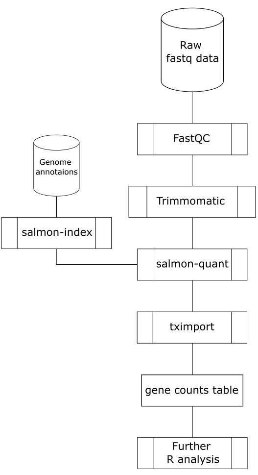

This document describes the pachyderm setup for RNAseq preprocessing pipeline (as of 2018 version).

Content:
- Input data
- Preprocessing tools
- Pipeline setup (see json files)
- Output

1) Input data \
For inputs fastq files that are to be to be preprocessed and gene transcripts for building salmon index are mandatory. It is also a good practice to have a description profile for the experiment which describes how samples were acquired and which technology was used. This information can help to tune up pipeline and set up right parameters. \
So prerequisits are:
- experiment with fastq samples
- gene transcripts (which can be downloaded from [ensembl.org](http://www.ensembl.org/index.html))
- (optional) description of the experiment and samples

2) Preprocessing tools \
The pipeline uses an updated protocol for preprosessing NGS data and includes the following steps:
- FastQC (0.11.8) - quality control
- trimmomatic (0.38) - trimming adapters from samples
- salmon (0.11.3) - quantifying of the transcripts
- tximport (1.10.0) - assemble, format and prepare results for further analysis and processing in R environment



FastQC is the quality control tool for high throughput sequence data. FastQC aims to provide a simple way to do some quality control checks on raw sequence data coming from high throughput sequencing pipelines. It provides a modular set of analyses which you can use to give a quick impression of whether your data has any problems of which you should be aware before doing any further analysis. \
The main functions of FastQC are
- Import of data from BAM, SAM or FastQ files (any variant)
- Providing a quick overview to tell you in which areas there may be problems
- Summary graphs and tables to quickly assess your data
- Export of results to an HTML based permanent report
- Offline operation to allow automated generation of reports without running the interactive application
It is performed twice, before and after trimming procedure.

Trimmomatic is a tool for trimming Illumina FASTQ data and removing adapters.  When data is sequenced on Illumina, adapters are added for the fragments to attach to the beads.  If these adapters are not removed they can result in false assembly or other issues.  Additionally, the quality of the sequences varies across the length of the read, and poorer quality regions can be trimmed using Trimmomatic. \
An alternative to that is cutadapt, which is used in other flavors of that pipeline.

Salmon is a tool for quantifying the expression of transcripts using RNA-seq data. Salmon uses concept of quasi-mapping with a two-phase inference procedure to provide accurate expression estimates extremely fast, compared to tuxedo tools, and while using less memory. Salmon performs its inference using an expressive and realistic model of RNA-seq data that takes into account experimental attributes and biases commonly observed in real RNA-seq data.

tximport is commonly used R package for data export, preparation and evaluation from quantification and counting tools. It can import transcript-level abundance, estimated counts and transcript lengths, and summarize into matrices for use with downstream gene-level analysis packages.

3) Pipeline setup
Pipeline consists of 7 specification files, which are used to deploy pipeline to Pachyderm platform.
The naming convention for that is '{pipeline-id}-tool_suffix.json'. We have the following specs:

```sh
- {id}-fastqc_pre.json
- {id}-trimmomatic.json
- {id}-fastqc_post.json
- {id}-salmon_idx.json
- {id}-salmon_quant.json
- {id}-tximport.json
- {id}-export.json - optional # TODO
```

For each of the pipeline steps the following happens:

* FastQC \
Quality control before and after trimming procedure. Command: \
```python fastqc.py -i /pfs/input-${id}``` \
'-i' indicates input folder with *.fastq files.

* trimmomatic \
Trimming adapters from raw files. Command: \
```python trimmomatic.py -i input-${id} -m SE -q -phred33 -c "ILLUMINACLIP:./trimmomatic/adapters/TruSeq3-SE.fa:2:30:10 LEADING:30 TRAILING:30 SLIDINGWINDOW:4:15 MINLEN:21"``` \
'-i' indicates input folder with *.fastq files. '-m' means mode - single end (SE) or paired end (PE). '-q' indicates format to covert quality scores (pred33 or pred64). '-c' is a string with additional arguments: specified adapter for fastq files, remove leading and trailing clipping, use sliding window for clipping with size 4 and quality threshold 15, drop reads below 21 bases long.

* salmon - indexing \
Building mapping-based index. Command: \
```python salmon.py -i /pfs/input_transcr_grch38_v86-${id} -m index -a -k 21 --perfectHash``` \
'-i' indicates input folder with transcripts. '-m' means mode  - index for indexing of transcripts. '-a' - additional arguments. '-k' specifies k-mers length. '--perfectHash' enables perfect hash mod during indexing.

* salmon - quantification \
Quantify set of reads directly against this built index. Command: \
```python3 salmon.py -i /pfs/trimmomatic-${id} -m quant -x /pfs/salmon_idx-${id} -l A -r single -a --noLengthCorrection``` \
'-i' indicates input folder with trimmed reads. '-m' means quantification mode for salmon. '-x' is the folder with built index. '-l' is library type (A - auto - is by default). '-r' - read-type - single or paired reads. '-a' - additional arguments. '--noLengthCorrection' prevents length correction.

* tximport \
Estimates for transcript- and gene-level analysis. Command: \
```python tximport.py -i /pfs/salmon_quant-${id} -e v86``` \
'-i' indicates input folder with quantifications from salmon tool. '-e' indicates Ensemble database version (v86 for EnsDb.Hsapiens.v86 or v92 for EnsDb.Hsapiens.v92).

See json specification files for more information how it is processed in pachyderm platform.

For fast pipeline deployment we've created a Makefile. It checks if pachyderm CLI responds, creates input repositories, create pipelines from specifications and fill created repositories with data. When data is provided pipelines automatically start jobs, which process data. \
Also, if something is changed in configuration, we can easily update pipelines or remove them and respective repositories completely. When everything is deployed and started we can monitor job status via CLI.

Parallelizaton of pipelines: see docs K8s, pachyderm and pachyderm glob patterns.

4) Output \
When all jobs have finished processing, we can get our files via export step of our pipeline or directly from PFS. Also we have an ability to track the data origins in PFS via CLI client of Pachyderm. \
In the end we get raw counts, abundance and log2 scaled counts data from DeSeq rlog function.

5) Alternatives \
Trimmomatic could be switched to cutadapt with correct parameters. \
Salmon could be replaced with STAR, kallisto or bowtie. Though salmon seems to be the best option there in terms of speed, resources and precision.
